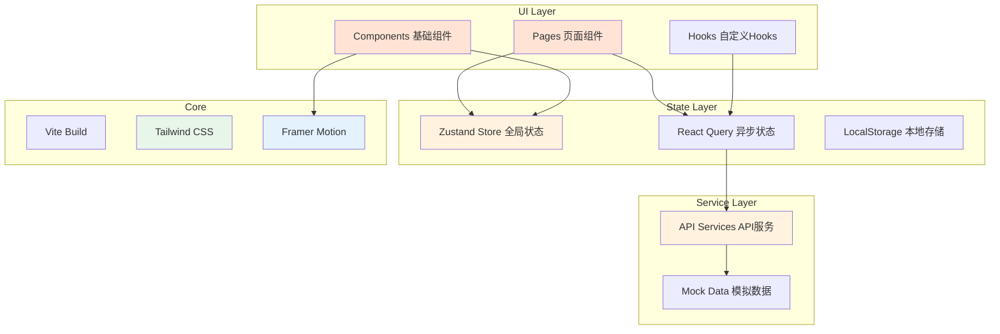

# GESP Ace 技术架构文档

> 版本：v1.0 | 创建日期：2026-05-08

---

## 1. 项目概述

本项目是GESP Ace的前端界面开发，采用React 18 + Vite + Tailwind CSS技术栈，实现温暖友好、活泼有趣的界面设计风格。

---

## 2. 技术架构

### 2.1 技术栈选型

| 技术 | 版本 | 说明 |
|-----|------|------|
| React | 18.x | UI框架 |
| Vite | 5.x | 构建工具 |
| Tailwind CSS | 3.x | 原子化CSS |
| React Router | 6.x | 路由管理 |
| Zustand | 4.x | 状态管理 |
| Framer Motion | 11.x | 动画库 |
| Lucide React | 最新 | 图标库 |
| Monaco Editor | 0.47.x | 代码编辑器 |
| React Query | 5.x | 数据请求 |

### 2.2 项目架构图



### 2.3 目录结构

```
gesp-ace/
├── public/
│   └── favicon.ico
├── src/
│   ├── assets/                 # 静态资源
│   │   ├── images/            # 图片资源
│   │   └── icons/             # 自定义图标
│   ├── components/            # 通用组件
│   │   ├── ui/               # UI基础组件
│   │   │   ├── Button.tsx
│   │   │   ├── Card.tsx
│   │   │   ├── Badge.tsx
│   │   │   ├── Progress.tsx
│   │   │   └── Modal.tsx
│   │   ├── layout/           # 布局组件
│   │   │   ├── Header.tsx
│   │   │   ├── Navbar.tsx
│   │   │   └── Container.tsx
│   │   ├── practice/         # 练习相关组件
│   │   │   ├── QuestionCard.tsx
│   │   │   ├── OptionButton.tsx
│   │   │   ├── CodeEditor.tsx
│   │   │   └── AnswerFeedback.tsx
│   │   └── common/           # 通用业务组件
│   │       ├── LevelCard.tsx
│   │       ├── DailyPracticeBanner.tsx
│   │       ├── StreakCalendar.tsx
│   │       ├── AchievementBadge.tsx
│   │       └── KnowledgeTree.tsx
│   ├── pages/                # 页面组件
│   │   ├── Home.tsx          # 首页
│   │   ├── Daily.tsx         # 每日一练
│   │   ├── Practice.tsx      # 刷题模式
│   │   ├── Exam.tsx          # 模拟考试
│   │   ├── Mistakes.tsx      # 错题本
│   │   ├── Knowledge.tsx     # 知识点地图
│   │   ├── Profile.tsx       # 个人中心
│   │   └── Coding.tsx        # 编程题答题
│   ├── stores/               # Zustand状态管理
│   │   ├── userStore.ts      # 用户状态
│   │   ├── practiceStore.ts  # 练习状态
│   │   └── appStore.ts       # 应用状态
│   ├── services/             # API服务
│   │   ├── api.ts            # API封装
│   │   └── mockData.ts       # 模拟数据
│   ├── hooks/                # 自定义Hooks
│   │   ├── useQuestions.ts   # 题目相关
│   │   ├── useProgress.ts    # 进度相关
│   │   └── useAnimation.ts  # 动画相关
│   ├── utils/                # 工具函数
│   │   ├── cn.ts             # className合并
│   │   └── storage.ts        # 本地存储
│   ├── styles/               # 全局样式
│   │   └── globals.css       # 全局CSS
│   ├── App.tsx               # 根组件
│   └── main.tsx              # 入口文件
├── index.html
├── package.json
├── vite.config.ts
├── tailwind.config.js
├── postcss.config.js
└── tsconfig.json
```

---

## 3. 路由设计

### 3.1 路由配置

```typescript
// src/router/index.tsx
import { createBrowserRouter } from 'react-router-dom';
import Home from '@/pages/Home';
import Daily from '@/pages/Daily';
import Practice from '@/pages/Practice';
import Exam from '@/pages/Exam';
import Mistakes from '@/pages/Mistakes';
import Knowledge from '@/pages/Knowledge';
import Profile from '@/pages/Profile';
import Coding from '@/pages/Coding';

export const router = createBrowserRouter([
  {
    path: '/',
    element: <Home />,
    label: '首页'
  },
  {
    path: '/daily',
    element: <Daily />,
    label: '每日一练'
  },
  {
    path: '/practice',
    element: <Practice />,
    label: '刷题'
  },
  {
    path: '/practice/:level',
    element: <Practice />,
    label: '刷题'
  },
  {
    path: '/exam',
    element: <Exam />,
    label: '模拟考试'
  },
  {
    path: '/mistakes',
    element: <Mistakes />,
    label: '错题本'
  },
  {
    path: '/knowledge',
    element: <Knowledge />,
    label: '知识点'
  },
  {
    path: '/profile',
    element: <Profile />,
    label: '我的'
  },
  {
    path: '/coding/:id',
    element: <Coding />,
    label: '编程答题'
  }
]);
```

### 3.2 路由守卫

```typescript
// 未登录重定向到首页
const ProtectedRoute = ({ children }: { children: React.ReactNode }) => {
  const { isLoggedIn } = useUserStore();
  
  if (!isLoggedIn) {
    return <Navigate to="/" replace />;
  }
  
  return children;
};
```

---

## 4. 状态管理

### 4.1 用户状态 (userStore)

```typescript
// src/stores/userStore.ts
import { create } from 'zustand';
import { persist } from 'zustand/middleware';

interface UserState {
  // 用户信息
  userId: string;
  username: string;
  avatar: string;
  currentLevel: number;
  totalScore: number;
  
  // 学习数据
  streakDays: number;           // 连续打卡天数
  totalPracticeDays: number;    // 总练习天数
  achievements: string[];       // 已获得成就
  
  // 等级进度
  levelProgress: {
    [level: number]: {
      correctRate: number;
      practicedCount: number;
      status: 'locked' | 'in_progress' | 'mastered' | 'weak';
    }
  };
  
  // Actions
  updateProgress: (level: number, correctRate: number) => void;
  addStreak: () => void;
  resetStreak: () => void;
  addAchievement: (id: string) => void;
}

export const useUserStore = create<UserState>()(
  persist(
    (set) => ({
      userId: 'user_001',
      username: '张同学',
      avatar: '/avatars/default.png',
      currentLevel: 2,
      totalScore: 1250,
      streakDays: 7,
      totalPracticeDays: 45,
      achievements: ['first_practice', 'streak_3', 'streak_7'],
      levelProgress: {
        1: { correctRate: 0.85, practicedCount: 120, status: 'mastered' },
        2: { correctRate: 0.62, practicedCount: 85, status: 'in_progress' },
        3: { correctRate: 0.31, practicedCount: 30, status: 'weak' },
        4: { correctRate: 0, practicedCount: 0, status: 'locked' },
        // ... 其他等级
      },
      
      updateProgress: (level, correctRate) => set((state) => ({
        levelProgress: {
          ...state.levelProgress,
          [level]: {
            ...state.levelProgress[level],
            correctRate,
            status: correctRate >= 0.8 ? 'mastered' : 
                    correctRate >= 0.4 ? 'in_progress' : 'weak'
          }
        }
      })),
      
      addStreak: () => set((state) => ({ 
        streakDays: state.streakDays + 1,
        totalPracticeDays: state.totalPracticeDays + 1
      })),
      
      resetStreak: () => set({ streakDays: 0 }),
      
      addAchievement: (id) => set((state) => ({
        achievements: [...state.achievements, id]
      }))
    }),
    {
      name: 'gesp-user-storage'
    }
  )
);
```

### 4.2 练习状态 (practiceStore)

```typescript
// src/stores/practiceStore.ts
import { create } from 'zustand';

interface Question {
  id: string;
  type: 'choice' | 'judgment' | 'coding';
  content: string;
  options?: string[];
  correctAnswer: string | number;
  knowledgePoint: string;
  difficulty: 1 | 2 | 3;
  points: number;
}

interface PracticeState {
  // 每日一练
  dailyQuestions: Question[];
  dailyCompleted: number;
  dailyAnswers: Map<string, string>;
  
  // 当前练习
  currentQuestion: Question | null;
  currentQuestionIndex: number;
  
  // 错题本
  mistakes: Question[];
  
  // 收藏
  favorites: string[];
  
  // Actions
  submitAnswer: (questionId: string, answer: string) => boolean;
  nextQuestion: () => void;
  addToMistakes: (question: Question) => void;
  removeFromMistakes: (questionId: string) => void;
  toggleFavorite: (questionId: string) => void;
  resetDailyPractice: () => void;
}

export const usePracticeStore = create<PracticeState>((set, get) => ({
  dailyQuestions: [],
  dailyCompleted: 0,
  dailyAnswers: new Map(),
  currentQuestion: null,
  currentQuestionIndex: 0,
  mistakes: [],
  favorites: [],
  
  submitAnswer: (questionId, answer) => {
    const question = get().dailyQuestions.find(q => q.id === questionId);
    if (!question) return false;
    
    const isCorrect = answer === String(question.correctAnswer);
    
    set((state) => ({
      dailyAnswers: new Map(state.dailyAnswers).set(questionId, answer),
      dailyCompleted: state.dailyCompleted + 1
    }));
    
    if (!isCorrect) {
      get().addToMistakes(question);
    }
    
    return isCorrect;
  },
  
  nextQuestion: () => set((state) => ({
    currentQuestionIndex: state.currentQuestionIndex + 1,
    currentQuestion: state.dailyQuestions[state.currentQuestionIndex + 1]
  })),
  
  addToMistakes: (question) => set((state) => {
    if (state.mistakes.find(m => m.id === question.id)) return state;
    return { mistakes: [...state.mistakes, question] };
  }),
  
  removeFromMistakes: (questionId) => set((state) => ({
    mistakes: state.mistakes.filter(m => m.id !== questionId)
  })),
  
  toggleFavorite: (questionId) => set((state) => ({
    favorites: state.favorites.includes(questionId)
      ? state.favorites.filter(id => id !== questionId)
      : [...state.favorites, questionId]
  })),
  
  resetDailyPractice: () => set({
    dailyCompleted: 0,
    dailyAnswers: new Map(),
    currentQuestionIndex: 0,
    currentQuestion: null
  })
}));
```

---

## 5. 组件设计

### 5.1 基础UI组件

#### Button 按钮组件

```typescript
// src/components/ui/Button.tsx
interface ButtonProps extends React.ButtonHTMLAttributes<HTMLButtonElement> {
  variant?: 'primary' | 'secondary' | 'ghost' | 'danger';
  size?: 'sm' | 'md' | 'lg';
  loading?: boolean;
  icon?: React.ReactNode;
}

export const Button = ({
  children,
  variant = 'primary',
  size = 'md',
  loading = false,
  icon,
  className,
  ...props
}: ButtonProps) => {
  const baseStyles = 'inline-flex items-center justify-center font-medium rounded-full transition-all duration-300';
  
  const variants = {
    primary: 'bg-gradient-to-r from-[#FF8C42] to-[#FFB074] text-white shadow-lg hover:shadow-xl hover:brightness-110 active:scale-95',
    secondary: 'bg-white text-[#FF8C42] border-2 border-[#FF8C42] hover:bg-[#FFF5EB] active:scale-95',
    ghost: 'text-[#666666] hover:bg-[#F5F5F5] active:scale-95',
    danger: 'bg-[#FF6B6B] text-white hover:bg-[#FF5252] active:scale-95'
  };
  
  const sizes = {
    sm: 'px-4 py-2 text-sm',
    md: 'px-6 py-3 text-base',
    lg: 'px-8 py-4 text-lg'
  };
  
  return (
    <motion.button
      whileHover={{ scale: 1.02 }}
      whileTap={{ scale: 0.95 }}
      className={cn(baseStyles, variants[variant], sizes[size], className)}
      disabled={loading}
      {...props}
    >
      {loading ? (
        <Loader2 className="w-5 h-5 animate-spin mr-2" />
      ) : icon ? (
        <span className="mr-2">{icon}</span>
      ) : null}
      {children}
    </motion.button>
  );
};
```

#### LevelCard 等级卡片组件

```typescript
// src/components/common/LevelCard.tsx
interface LevelCardProps {
  level: number;
  name: string;
  progress: number;
  status: 'mastered' | 'in_progress' | 'weak' | 'locked';
  onClick?: () => void;
}

export const LevelCard = ({ level, name, progress, status, onClick }: LevelCardProps) => {
  const statusConfig = {
    mastered: {
      bg: 'bg-gradient-to-br from-[#4CAF50] to-[#81C784]',
      icon: '⭐',
      label: '已掌握'
    },
    in_progress: {
      bg: 'bg-gradient-to-br from-[#FFD93D] to-[#FFE066]',
      icon: '📚',
      label: '进行中'
    },
    weak: {
      bg: 'bg-gradient-to-br from-[#FF6B6B] to-[#FF8E8E]',
      icon: '💪',
      label: '待加强'
    },
    locked: {
      bg: 'bg-gradient-to-br from-[#E0E0E0] to-[#BDBDBD]',
      icon: '🔒',
      label: '需解锁'
    }
  };
  
  const config = statusConfig[status];
  
  return (
    <motion.div
      whileHover={status !== 'locked' ? { y: -8, scale: 1.02 } : {}}
      whileTap={status !== 'locked' ? { scale: 0.98 } : {}}
      onClick={status !== 'locked' ? onClick : undefined}
      className={cn(
        'relative p-6 rounded-3xl cursor-pointer transition-all duration-300',
        config.bg,
        status === 'locked' && 'cursor-not-allowed opacity-80'
      )}
    >
      {/* 等级标识 */}
      <div className="text-6xl font-bold text-white/90 mb-2">
        Lv.{level}
      </div>
      
      {/* 等级名称 */}
      <div className="text-white font-medium mb-3">
        {name}
      </div>
      
      {/* 进度或状态 */}
      {status !== 'locked' ? (
        <div className="space-y-2">
          <div className="flex items-center justify-between text-white/90 text-sm">
            <span>{config.icon} {config.label}</span>
            <span>{Math.round(progress * 100)}%</span>
          </div>
          <div className="h-2 bg-white/30 rounded-full overflow-hidden">
            <motion.div
              initial={{ width: 0 }}
              animate={{ width: `${progress * 100}%` }}
              transition={{ duration: 1, ease: 'easeOut' }}
              className="h-full bg-white rounded-full"
            />
          </div>
        </div>
      ) : (
        <div className="flex items-center gap-2 text-white/70">
          <span className="text-2xl">{config.icon}</span>
          <span className="text-sm">{config.label}</span>
        </div>
      )}
      
      {/* 装饰元素 */}
      {status === 'mastered' && (
        <div className="absolute -top-2 -right-2 text-4xl">
          ✨
        </div>
      )}
    </motion.div>
  );
};
```

#### QuestionCard 题目卡片组件

```typescript
// src/components/practice/QuestionCard.tsx
interface QuestionCardProps {
  question: {
    id: string;
    type: 'choice' | 'judgment' | 'coding';
    content: string;
    options?: string[];
  };
  selectedAnswer?: string;
  isCorrect?: boolean;
  showResult?: boolean;
  onSelect: (answer: string) => void;
}

export const QuestionCard = ({
  question,
  selectedAnswer,
  isCorrect,
  showResult,
  onSelect
}: QuestionCardProps) => {
  return (
    <motion.div
      initial={{ opacity: 0, y: 20 }}
      animate={{ opacity: 1, y: 0 }}
      exit={{ opacity: 0, y: -20 }}
      className="bg-white rounded-3xl p-6 shadow-lg"
    >
      {/* 题目标题 */}
      <div className="flex items-center gap-3 mb-4">
        <span className="px-3 py-1 bg-[#FFF5EB] text-[#FF8C42] rounded-full text-sm font-medium">
          {question.type === 'choice' ? '单选题' : 
           question.type === 'judgment' ? '判断题' : '编程题'}
        </span>
      </div>
      
      {/* 题目内容 */}
      <p className="text-xl text-[#333] leading-relaxed mb-6">
        {question.content}
      </p>
      
      {/* 选项列表 */}
      <div className="space-y-3">
        {question.options?.map((option, index) => {
          const isSelected = selectedAnswer === option;
          const optionLetter = String.fromCharCode(65 + index);
          
          return (
            <motion.button
              key={option}
              whileHover={{ scale: 1.01 }}
              whileTap={{ scale: 0.99 }}
              onClick={() => !showResult && onSelect(option)}
              disabled={showResult}
              className={cn(
                'w-full p-4 rounded-2xl text-left transition-all duration-300',
                'border-2 flex items-center gap-4',
                !showResult && 'hover:border-[#FF8C42] hover:bg-[#FFF9F5]',
                showResult && isSelected && isCorrect && 
                  'border-[#4CAF50] bg-[#E8F5E9]',
                showResult && isSelected && !isCorrect && 
                  'border-[#FF6B6B] bg-[#FFEBEE]',
                showResult && !isSelected && 
                  'border-gray-200 bg-gray-50 opacity-60'
              )}
            >
              <span className={cn(
                'w-10 h-10 rounded-full flex items-center justify-center font-bold text-lg',
                !showResult && 'bg-[#FFF5EB] text-[#FF8C42]',
                showResult && isSelected && isCorrect && 'bg-[#4CAF50] text-white',
                showResult && isSelected && !isCorrect && 'bg-[#FF6B6B] text-white',
                showResult && !isSelected && 'bg-gray-200 text-gray-500'
              )}>
                {showResult && isSelected && isCorrect && '✓'}
                {showResult && isSelected && !isCorrect && '✗'}
                {showResult && !isSelected && optionLetter}
                {!showResult && optionLetter}
              </span>
              <span className="flex-1 text-[#333]">{option}</span>
            </motion.button>
          );
        })}
      </div>
      
      {/* 答题反馈 */}
      {showResult && (
        <motion.div
          initial={{ opacity: 0, y: 10 }}
          animate={{ opacity: 1, y: 0 }}
          className={cn(
            'mt-6 p-4 rounded-2xl',
            isCorrect ? 'bg-[#E8F5E9] text-[#4CAF50]' : 'bg-[#FFEBEE] text-[#FF6B6B]'
          )}
        >
          <div className="flex items-center gap-2 font-bold text-lg mb-2">
            {isCorrect ? '🎉 回答正确！' : '😢 回答错误'}
            <span className="ml-auto text-sm">
              {isCorrect ? '+2分' : '+0分'}
            </span>
          </div>
          {!isCorrect && (
            <p className="text-sm">
              正确答案：{question.options?.findIndex(o => o === String(question.options?.[0])) === -1}
            </p>
          )}
        </motion.div>
      )}
    </motion.div>
  );
};
```

---

## 6. 动画设计

### 6.1 页面过渡动画

```typescript
// src/components/layout/PageTransition.tsx
export const PageTransition = ({ children }: { children: React.ReactNode }) => {
  return (
    <motion.div
      initial={{ opacity: 0, y: 30 }}
      animate={{ opacity: 1, y: 0 }}
      exit={{ opacity: 0, y: -30 }}
      transition={{
        duration: 0.4,
        ease: [0.34, 1.56, 0.64, 1] // 弹性缓动
      }}
    >
      {children}
    </motion.div>
  );
};
```

### 6.2 卡片入场动画

```typescript
// src/hooks/useStaggerAnimation.ts
export const useStaggerAnimation = (itemCount: number) => {
  return {
    initial: { opacity: 0, y: 20 },
    animate: { opacity: 1, y: 0 },
    transition: (index: number) => ({
      delay: index * 0.1,
      duration: 0.5,
      ease: [0.34, 1.56, 0.64, 1]
    })
  };
};

// 使用示例
const cardVariants = {
  hidden: { opacity: 0, scale: 0.8 },
  visible: (i: number) => ({
    opacity: 1,
    scale: 1,
    transition: {
      delay: i * 0.1,
      duration: 0.5,
      ease: [0.34, 1.56, 0.64, 1]
    }
  })
};
```

### 6.3 答题反馈动画

```typescript
// src/components/practice/AnswerFeedback.tsx
export const AnswerFeedback = ({ isCorrect, onComplete }: AnswerFeedbackProps) => {
  return (
    <motion.div
      initial={{ scale: 0 }}
      animate={{ scale: 1 }}
      exit={{ scale: 0 }}
      className="fixed inset-0 flex items-center justify-center bg-black/30 z-50"
    >
      <motion.div
        initial={{ scale: 0 }}
        animate={{ scale: 1 }}
        transition={{ 
          delay: 0.1,
          type: 'spring',
          stiffness: 200,
          damping: 15
        }}
        className={cn(
          'w-40 h-40 rounded-full flex items-center justify-center',
          isCorrect ? 'bg-[#4CAF50]' : 'bg-[#FF6B6B]'
        )}
      >
        <motion.span
          initial={{ scale: 0 }}
          animate={{ scale: 1 }}
          transition={{ delay: 0.3, type: 'spring' }}
          className="text-6xl"
        >
          {isCorrect ? '✓' : '✗'}
        </motion.span>
      </motion.div>
      
      {/* 星星散落效果 */}
      {isCorrect && (
        <div className="absolute inset-0 pointer-events-none">
          {[...Array(6)].map((_, i) => (
            <motion.div
              key={i}
              initial={{ 
                x: 0, 
                y: 0, 
                opacity: 1,
                scale: 1
              }}
              animate={{
                x: (Math.random() - 0.5) * 300,
                y: (Math.random() - 0.5) * 300,
                opacity: 0,
                scale: 0
              }}
              transition={{ duration: 1, delay: 0.2 }}
              className="absolute top-1/2 left-1/2 text-3xl"
            >
              ⭐
            </motion.div>
          ))}
        </div>
      )}
    </motion.div>
  );
};
```

---

## 7. 样式规范

### 7.1 Tailwind配置

```javascript
// tailwind.config.js
/** @type {import('tailwindcss').Config} */
export default {
  content: [
    "./index.html",
    "./src/**/*.{js,ts,jsx,tsx}",
  ],
  theme: {
    extend: {
      colors: {
        primary: {
          DEFAULT: '#FF8C42',
          light: '#FFB074',
          dark: '#E67530'
        },
        success: '#4CAF50',
        warning: '#FFD93D',
        danger: '#FF6B6B',
        info: '#74C0FC'
      },
      fontFamily: {
        display: ['"ZCOOL KuaiLe"', 'cursive'],
        body: ['"Noto Sans SC"', 'sans-serif'],
        mono: ['"JetBrains Mono"', 'monospace']
      },
      borderRadius: {
        'sm': '8px',
        'md': '16px',
        'lg': '24px',
        'xl': '32px'
      },
      boxShadow: {
        'soft': '0 4px 16px rgba(0, 0, 0, 0.08)',
        'card': '0 8px 32px rgba(0, 0, 0, 0.12)',
        'glow': '0 0 20px rgba(255, 140, 66, 0.3)'
      },
      animation: {
        'bounce-soft': 'bounce-soft 2s infinite',
        'float': 'float 3s ease-in-out infinite',
        'pulse-soft': 'pulse-soft 2s ease-in-out infinite'
      },
      keyframes: {
        'bounce-soft': {
          '0%, 100%': { transform: 'translateY(0)' },
          '50%': { transform: 'translateY(-10px)' }
        },
        'float': {
          '0%, 100%': { transform: 'translateY(0) rotate(0deg)' },
          '50%': { transform: 'translateY(-20px) rotate(5deg)' }
        },
        'pulse-soft': {
          '0%, 100%': { opacity: '1' },
          '50%': { opacity: '0.7' }
        }
      }
    },
  },
  plugins: [],
}
```

### 7.2 全局样式

```css
/* src/styles/globals.css */
@import url('https://fonts.googleapis.com/css2?family=Noto+Sans+SC:wght@400;500;700&family=ZCOOL+KuaiLe&display=swap');

@tailwind base;
@tailwind components;
@tailwind utilities;

@layer base {
  html {
    font-family: 'Noto Sans SC', sans-serif;
    background-color: #FFF9F5;
  }
  
  body {
    @apply text-[#333] antialiased;
    background: linear-gradient(180deg, #FFF9F5 0%, #FFF5EB 100%);
    min-height: 100vh;
  }
  
  * {
    @apply border-gray-200;
  }
}

@layer components {
  .card {
    @apply bg-white rounded-3xl p-6 shadow-soft;
  }
  
  .btn-primary {
    @apply inline-flex items-center justify-center px-6 py-3 
           bg-gradient-to-r from-primary to-primary-light 
           text-white font-medium rounded-full
           shadow-lg hover:shadow-xl hover:brightness-110 
           active:scale-95 transition-all duration-300;
  }
  
  .text-gradient {
    @apply bg-gradient-to-r from-primary to-primary-light 
           bg-clip-text text-transparent;
  }
}

@layer utilities {
  .no-scrollbar::-webkit-scrollbar {
    display: none;
  }
  
  .no-scrollbar {
    -ms-overflow-style: none;
    scrollbar-width: none;
  }
}
```

---

## 8. 数据模拟

### 8.1 模拟数据服务

```typescript
// src/services/mockData.ts
import { Question } from '@/types';

export const mockQuestions: Question[] = [
  {
    id: 'q001',
    type: 'choice',
    content: '在C++中，以下哪个是合法的变量名？',
    options: ['2name', '_name', 'my-name', 'class'],
    correctAnswer: '_name',
    knowledgePoint: 'L1-T2',
    difficulty: 1,
    points: 2
  },
  {
    id: 'q002',
    type: 'judgment',
    content: 'C++中，所有语句都必须以分号结束。',
    correctAnswer: 'true',
    knowledgePoint: 'L1-T1',
    difficulty: 1,
    points: 2
  },
  {
    id: 'q003',
    type: 'coding',
    content: '请编写一个程序，输出 "Hello World"',
    correctAnswer: '#include <iostream>\nusing namespace std;\nint main() {\n    cout << "Hello World";\n    return 0;\n}',
    knowledgePoint: 'L1-T6',
    difficulty: 1,
    points: 25
  }
];

export const mockUser = {
  username: '张同学',
  avatar: '/avatars/default.png',
  currentLevel: 2,
  streakDays: 7,
  levelProgress: [
    { level: 1, status: 'mastered', correctRate: 0.85 },
    { level: 2, status: 'in_progress', correctRate: 0.62 },
    { level: 3, status: 'weak', correctRate: 0.31 },
    { level: 4, status: 'locked', correctRate: 0 }
  ]
};

export const mockKnowledgeTree = {
  1: {
    name: '一级·编程入门',
    topics: [
      { id: 'L1-T1', name: '计算机基础与编程环境', count: 50 },
      { id: 'L1-T2', name: '变量定义与使用', count: 80 },
      { id: 'L1-T3', name: '基本数据类型', count: 50 }
    ]
  },
  2: {
    name: '二级·程序基础设计',
    topics: [
      { id: 'L2-T1', name: '计算机的存储与网络', count: 40 },
      { id: 'L2-T2', name: '程序设计语言的特点', count: 30 }
    ]
  }
};
```

---

## 9. 性能优化

### 9.1 代码分割

```typescript
// src/App.tsx
const Home = lazy(() => import('@/pages/Home'));
const Daily = lazy(() => import('@/pages/Daily'));
const Practice = lazy(() => import('@/pages/Practice'));
// ...

export const App = () => {
  return (
    <Suspense fallback={<Loading />}>
      <RouterProvider router={router} />
    </Suspense>
  );
};
```

### 9.2 图片优化

```typescript
// 使用 WebP 格式
// 提供渐进式加载
// 使用骨架屏占位
```

### 9.3 动画性能

```typescript
// 使用 transform 和 opacity
// 避免 layout thrashing
// 使用 will-change 提示
```

---

## 10. 开发规范

### 10.1 代码规范

- 使用 TypeScript 严格模式
- 使用 ESLint + Prettier
- 组件使用函数式组件 + Hooks
- 样式使用 Tailwind CSS
- 动画使用 Framer Motion

### 10.2 Git提交规范

```
feat: 新功能
fix: 修复bug
docs: 文档更新
style: 代码格式
refactor: 重构
perf: 性能优化
test: 测试
chore: 构建/工具
```

---

## 11. 附录

### 11.1 技术文档链接

- React 18: https://react.dev
- Vite: https://vitejs.dev
- Tailwind CSS: https://tailwindcss.com
- Framer Motion: https://www.framer.com/motion/
- Zustand: https://zustand-demo.pmnd.rs

### 11.2 设计参考

- 图标库：Lucide Icons
- 字体：ZCOOL KuaiLe、Noto Sans SC
- 色彩灵感：温暖的橙色调色板
